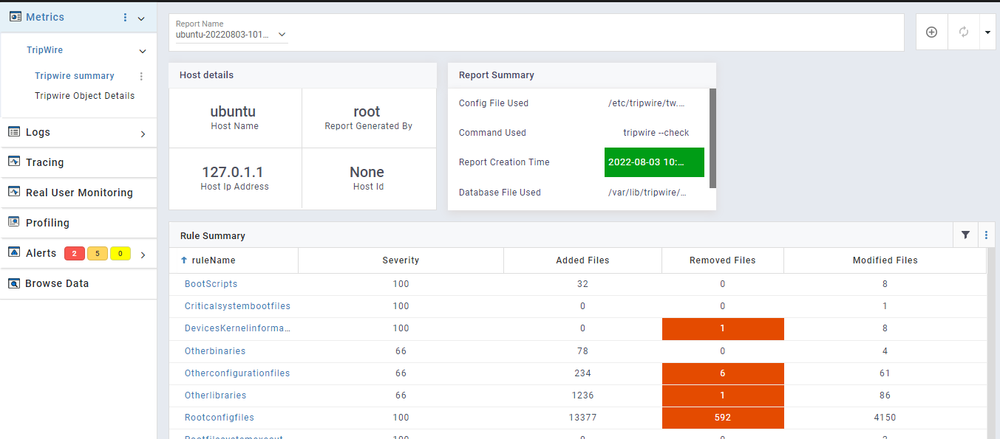
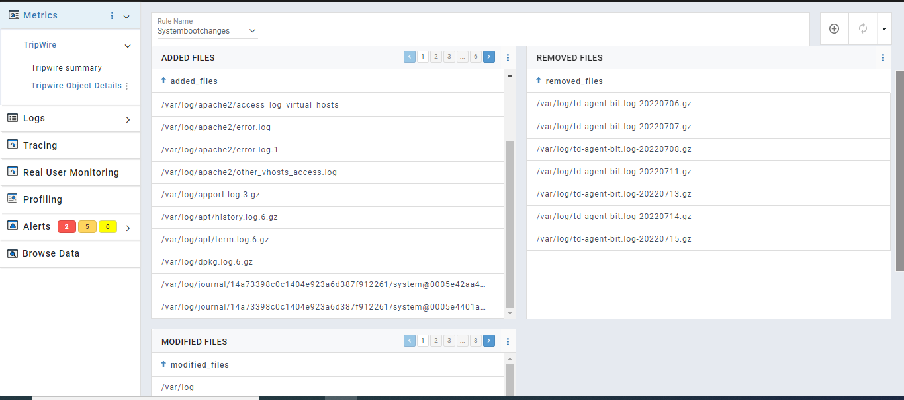

# Monitor TripWire

## Overview

Tripwire Metric Plugin parses reports generated by Tripwire Intrusion Detection System.

## Prerequisites

- Tripwire plugin supported only for ubuntu and centos distributions. For other platforms, reach out to support@snappyflow.io

- Tripwire plugin requires Tripwire package to be installed
  
  For installation of Tripwire package
  
  - Centos Distributions refer [centos](https://www.howtoforge.com/tutorial/monitoring-and-detecting-modified-files-using-tripwire-on-centos-7/) 
  
  - Ubuntu distributions refer  [ubuntu](https://techdirectarchive.com/2022/03/24/how-to-install-and-configure-tripwire-on-ubuntu/)

## Configuration Settings

Refer to [sfAgent](/docs/Quick_Start/getting_started#sfagent) section for steps to install and configure sfagent. Tripwire plugin configurations can be automatically generated by sfagent or added manually. To manually add the configuration, update  `config.yaml` under `/opt/sfagent` directory

```yaml
metrics: 
  metrics: 
  plugins: 
    - name: tripwire
      enabled: true
      interval: 300
      config:
        report_path: /var/lib/tripwire/report
```

If Tripwire reports need to be triggered automatically once in the day, you can add a cron job for it.
To add a Cronjob,

```commandline
    crontab -e
```

add,

```
0 0 * * * tripwire --check
```

Once you save the file, a cron job gets scheduled automatically. 

if you want to run the Cronjob at a specific time everyday at say 11:30 AM, use following command

```commandline
 30 11 * * * tripwire --check
```

To trigger a Tripwire report at any point in time, use the following command

```
tripwire --check 
```

## Documents

It consists of three document types

- `tripwireReportSummary` : contains information about report creation date, user who created, policy used , command used for triggering report
- `tripwireRuleSummary` : contains information related to list of rules added for monitoring and its severity, count of added, removed and modified files
- `tripwireObjectSummary` : contains detailed information about list of added, removed and modified files per rules

Use the built-in TripWire dashboard for data visualization.

### Tripwire summary pane



### Tripwire object details pane



## Viewing data and dashboards

Data collected by plugins can be viewed in SnappyFlow’s browse data section under metrics section 

`plugin: TripWire`

`documentType: tripwireReportSummary, tripwireRuleSummary, tripwireObjectSummary`

Dashboard template: `TripWire`

For help with plugins, please reach out to [support@snappyflow.io](mailto:support@snappyflow.io).