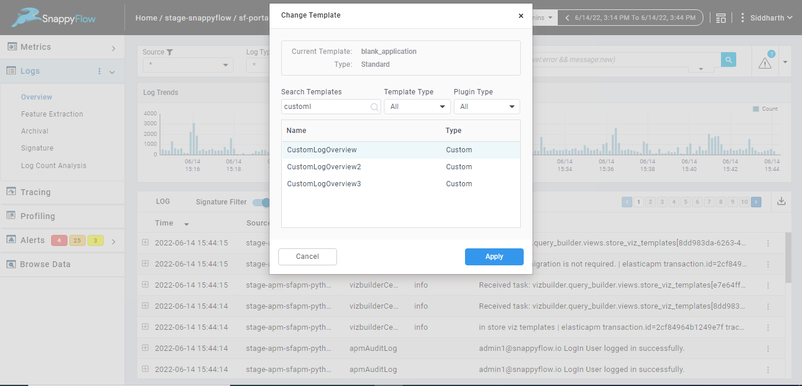
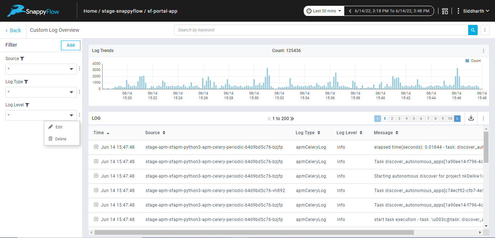
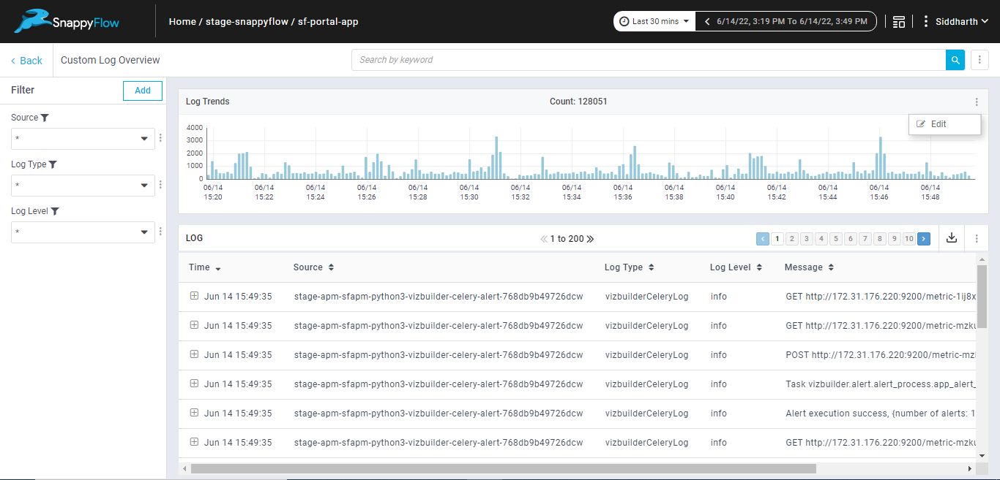
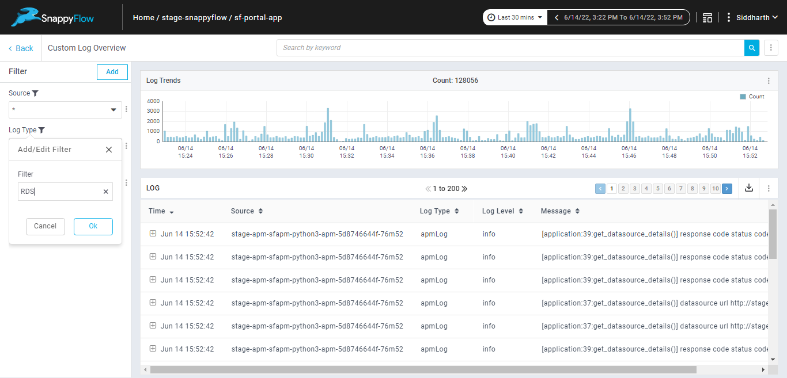
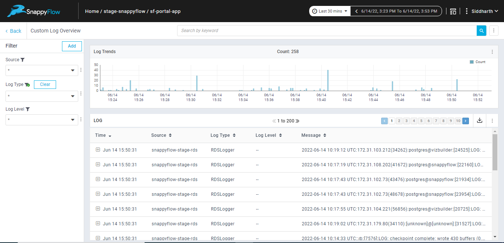

# What is Custom Log Overview pane

Custom Log Overview is a built-in pane for providing a customized overview of the data present in the Logs. This pane contains 3 filters (Source, Log Type and Log Level), a line chart and a table by default. This pane is available under CustomLogOverview template. 

## Viewing Custom Log Overview pane

The custom Log Overview pane can be viewed in two ways

- Import the Custom Log Overview pane under Metrics/Logs tab from CustomLogOverview template

- Change the dashboard template to CustomLogOverview template

  

:::note

In case the CustomLogOverview template is not available, upgrade templates

:::

 

 

## Features under Custom Log Overview pane

### Edit (Rename) / Delete the Custom Log Pane

 

 

### Add/ Edit/ Delete filters

In Custom Log Overview pane, the filters can be added/ edited/ deleted. The dependency of the filter will be automatically linked to the line chart and table component. 

:::note
 - Maximum of 10 filters are allowed  
 - The dependency of other filter(s) should be explicitly mentioned in the filter definition 
:::

 

### Modify the Line chart/ Table queries

The line chart and the table queries can be modified by editing the respective                components

 

### Modify the Table columns

The select fields under the table query can be modified in order to modify the table   columns 

### Download Logs

The logs can be downloaded by specifying the number of Records and the fields required.

 

### Dropdown Filters

By default, the dropdown list in any filter is limited to the top 50 records. To access specific records, use the dropdown filter    to limit the results to the provided search string. To quickly access a particular record, use the search option available in the dropdown. 

​	

 

