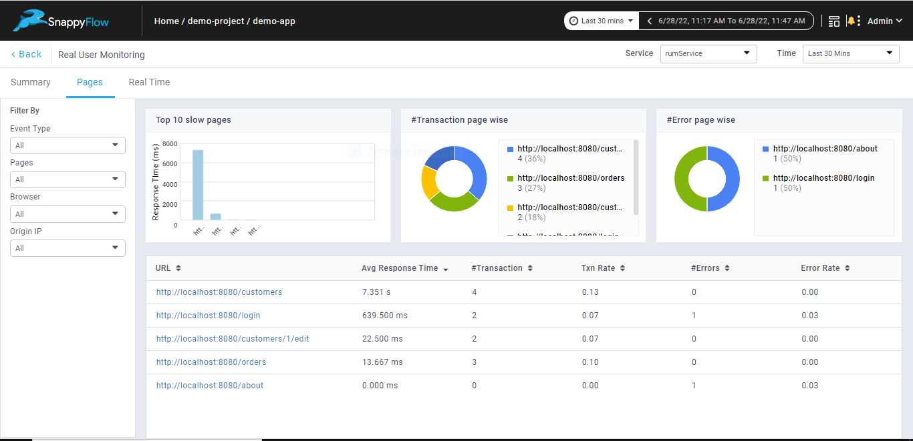
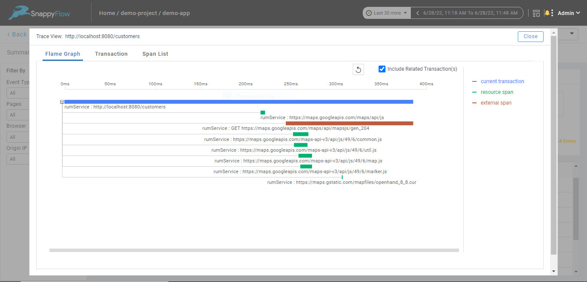

# Real User Monitoring in SnappyFlow

## Overview

Real User Monitoring (RUM) involves recording end-user interactions with a website or a client interacting with a server or cloud-based application. It  allows website/application owners to visualize the sequence of actions and [events](./RUM_Glossary/#event) that takes place during an interaction. Metrics such as [Response time](./RUM_Glossary/#response-time), [Transactions](./RUM_Glossary/#transaction), [Errors](./RUM_Glossary.md/#error), Event information, Browser information are monitored and visualized to help identify and troubleshoot website performance issues. 

## Supported Technologies  

All the applications developed using javascript or javascript based frameworks such as Angular, React, Vue etc are supported.  

## Setting up Real User Monitoring (RUM) in SnappyFlow

Snappyflow provides a lightweight and powerful `sf-apm-rum` agent that can be installed in your web application to monitor user integrations in real time. [Steps to install RUM agent](./RUM_agent_installation.md)

## Performance Metrics

Below are the various performance metrics that are captured by the `sf-apm-rum` agent

- [Apdex Rating](./RUM_Metrics.md/#apdex-rating)
- [Page load metrics](./RUM_Metrics.md/#page-load-metrics)
- [User interactions](./RUM_Metrics.md/#user-interactions)
- [User Centric Metrics](./RUM_Metrics.md/#user-centric-metrics)
- [JavaScript errors](./RUM_Metrics.md/#javascript-errors)

