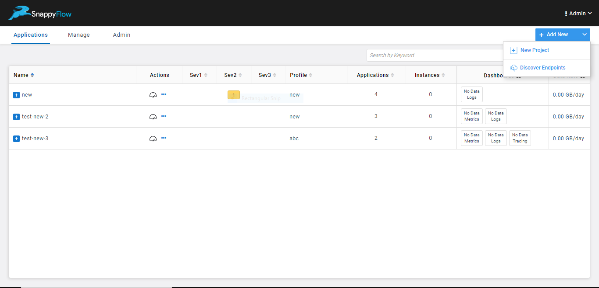
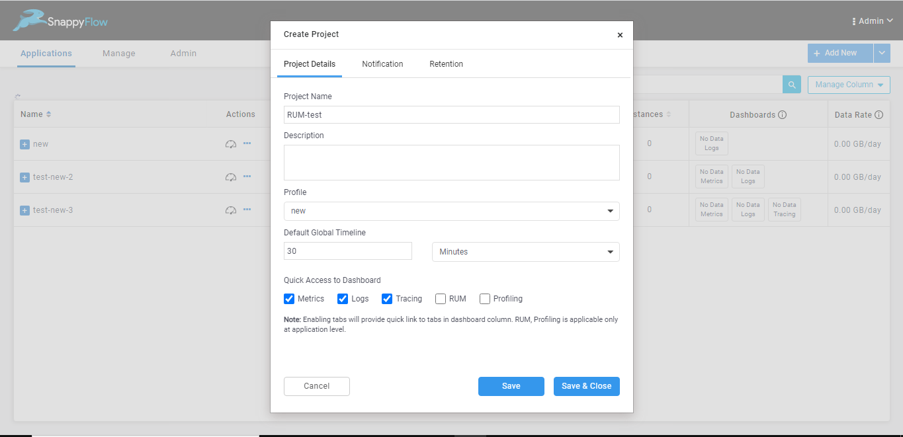
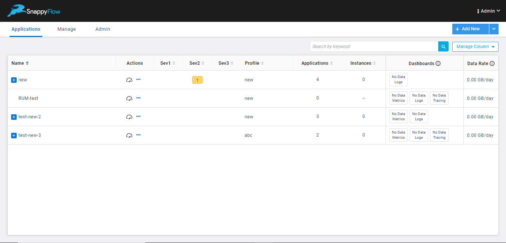
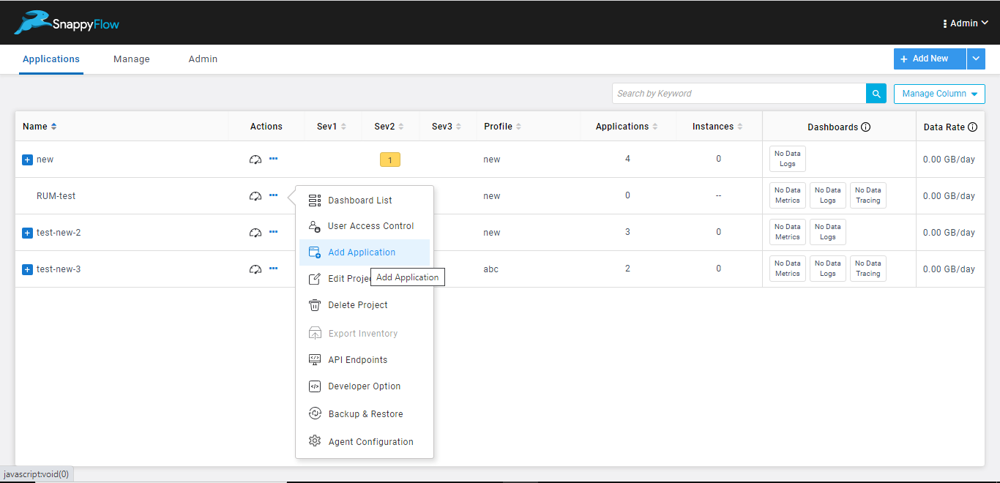
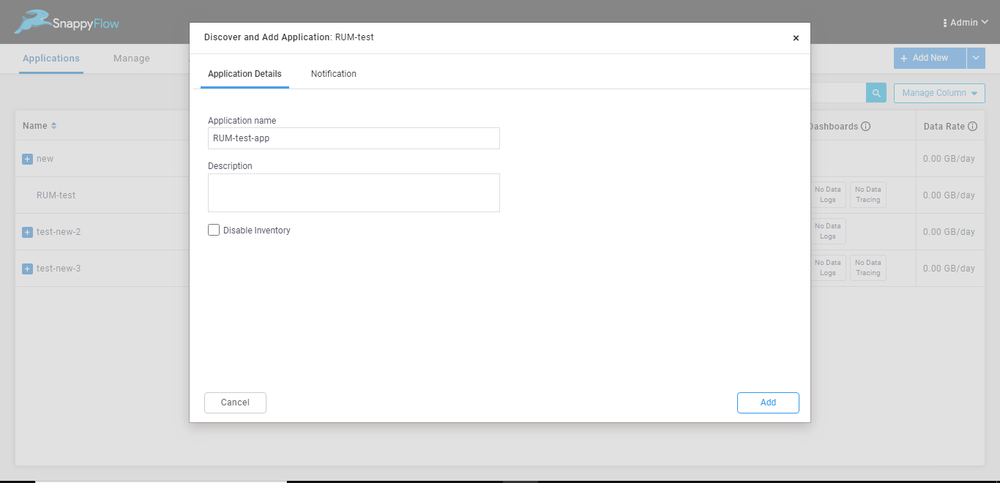
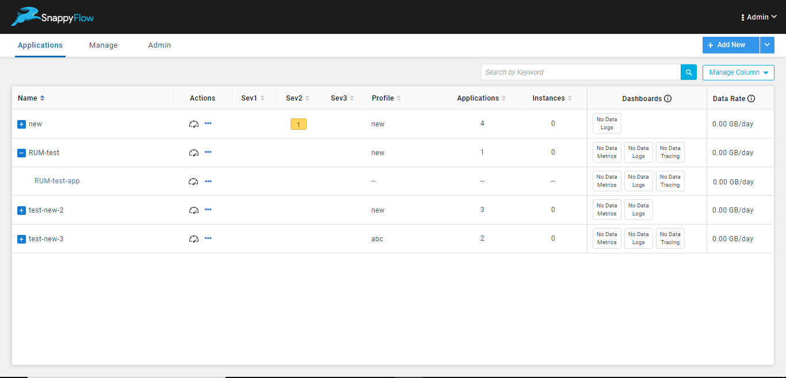

# Steps to install SnappyFlow RUM agent - Nextjs

:::note Prerequisites

Any web application developed using Nextjs.
:::

## **Step 1: Install the sf-apm-rum agent**

cd to the project directory and run the below command
```bash
$ npm install --save sf-apm-rum 
```


## **Step 2: Create a project and application in Snappyflow portal**

:::note  
If a project and application is already created or discovered on the snappyflow portal, this step can be skipped and the same can be used in the [sf-apm-rum agent configuration](#step-4-configure-the-sf-apm-rum-agent).
:::

### Create a project in snappyflow portal
i. Click on `+ Add New` in the snappyflow home page -> `+ New Project`. 
  

  
ii. Provide the required details -> `Save & Close`.  
  

  
iii. The project will be created.  
  

  

### Create an application under the required project
i. Click on the menu next to project name -> `+ Add application`.  
  

  
ii. Provide the required details -> `Add`.  
  

  
iii. The application will be created.


  

Use the above project name and application name in the [sf-apm-rum agent configuration](#step-4-configure-the-sf-apm-rum-agent).


## **Step 3: Import the sf-apm-rum package**

:::note

Since the library requires Web APIs to work, which are not available when Next.js pre-renders the page on the server-side, we have to use dynamic import here
:::

```js
 useEffect(() => {
 	const initFunction = async () => {
 	const sfApm = await import('sf-apm-rum')
     // Add Step 4 code here
 	}
 	initFunction()
}, [])
```

## **Step 4: Configure the sf-apm-rum agent**

Add the following code in the applications root component,
usually in pages/_app.js or _app.tsx if you are using typescript

```js
let apmRum = new sfApm.ApmRum(); // initialize the library

const apmData = {
	baseUrl: '<add-snappyflow-server-url-here>', // provide the URL of the snappyflow APM server that you are using to view the data
	profileKey: '<add-profile-key-here>', // paste the profile key copied from SF profile
	serviceName: '<your-apm-service-name>', // specify service name for RUM
	projectName: '<add-project-name-here>', // provide the snappyflow project name from step 2
	appName: '<add-application-name-here>', // provide the snappyflow application name from step 2
};
apmRum.init(apmData);
```

## **Step 5: Verify the setup**

Once the above mentioned steps are completed, restart the application and check for the RUM data in the Snappyflow APM server.

Click on View dashboard for the given application -> Click on Real User Monitoring Tab on left side bar -> Go to Real Time Pane.


## **Step 6: Debugging (In case of No Data in RUM Dashboard)**

##### i. **Check if data is available on the Snappyflow server**  
Navigate to the application dashboard -> Click on Browse Data -> Change the Index to "Real User Monitoring". Check if the data is available. If the data is available, it will be visible on the RUM Dashboard within few seconds.  

##### ii. **Check if the RUM data is sent from the configured application**  
Open the Developer tools for the configured web application on the browser -> Click on the Network Tab -> Trigger some actions in the application. Check if there is a `intake/v2/rum/events` call fired from the configured application side. If this call is made, it means that the data is being sent to the snappyflow server.   

##### iii. **Check if the configurations are correct**  
Check if the projectName and appName provided in the [Step 4](#step-4-configure-the-sf-apm-rum-agent) are matching the project name and application name in the snappyflow server.  
  