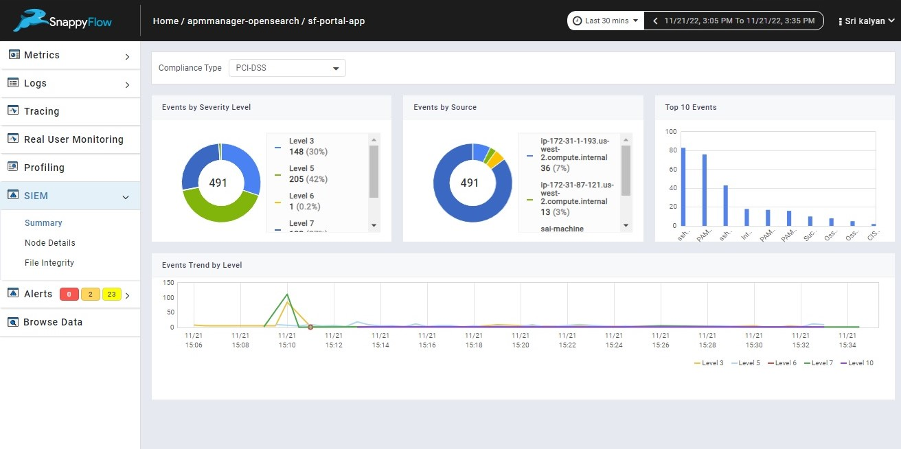
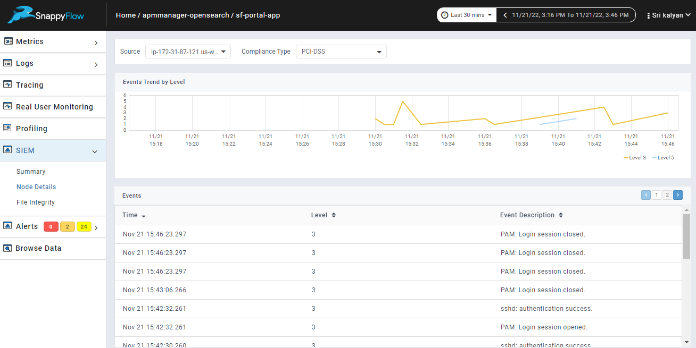
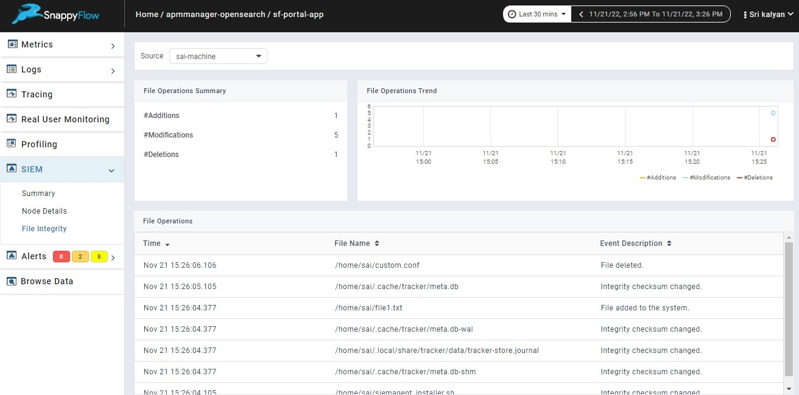

# SIEM Dashboard

The SIEM Tab is available under the application dashboard just below the Profiling Tab. The various views of the data captured by the SIEM Appliance can be viewed under this tab. There are 3 panes that help us provide different views of the captured data.

- [Summary](#summary-pane)
- [Node Details](#node-details-pane)
- [File Integrity](#file-integrity-pane)

## Summary Pane  

This pane provides the overview of the data captured. This view is helpful in understanding the statistics of events/alerts that have occured on the SIEM agent machines. The SIEM rules are mapped against compliance requirements to provide regulatory compliance support. When an alert is generated (a threat detection rule condition has been matched), it automatically includes compliance information [Compliance Types](./SIEM_documentation.md/#siem-compliance-types). It helps user to know the severity of events [Events by Severity](./SIEM_events.md/#siem-eventsrules), Events by Source or SIEM agents where the event has happened, Top 10 events to help the user to understand the count of repetitive or mostly happened events and Events Trend by Severity Level to visualize data. 

## Node Details Pane

This pane provides the source wise statistics of the SIEM events. Source here represents the SIEM Agent which is being monitored. It shows Events trend by Severity Level and displays all events in the table with description and severity level of the alert generated.

## File Integrity Pane

This pane provides the information on FIM(File Integrity Monitoring) [FIM](./siemagent_installation.md/#fimfile-itegrity-monitoring-configuration). It gives user insights on alerts generated on monitored directories/files by showing File Operations Summary which shows information on number of additions, modifications or deletions happened in the monitored directories, File Operations Trend based on File Operations and a table of File operations representing the time of operation, File name and event Description.

