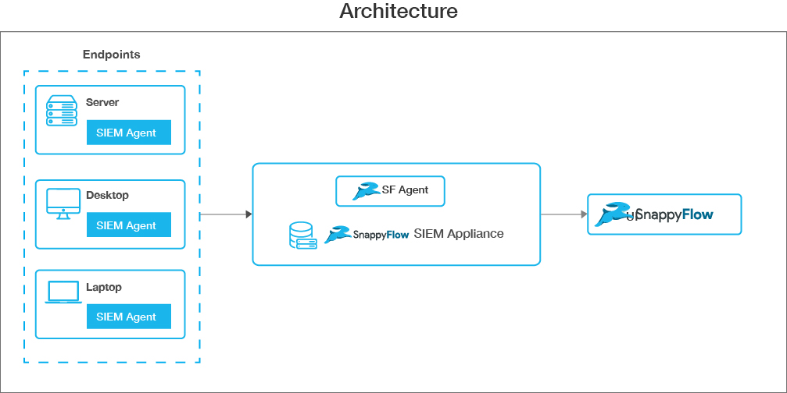

# SIEM (Security Information and Event Management)

## Overview

SIEM (Security Information and Event Management) offers analysis of events related to security, tracking and logging of security data.  This data can be used for compliance purposes. SIEM solution enhance threat detection, compliance, and security incident management through the gathering and analysis of real-time and historical security event data and sources.

If the system detects any threats the real-time alerts are generated and delivered to the SnappyFlow directly for remediation and further investigation. SIEM system makes it possible for analysts to take action on attacks on a quick basis. It can prevent a potential decrease in your Mean time to detect and respond too. It will also be able to reduce the time that a threat actor is in your environment.

### SIEM Compliance Types

- Payment Card Industry Data Security Standard (PCI DSS)

- General Data Protection Regulation (GDPR)

- NIST Special Publication 800-53 (NIST 800-53)

- Good Practice Guide 13 (GPG13)

- Trust Services Criteria (TSC SOC2)

- Health Insurance Portability and Accountability Act (HIPAA)

- Rules also include MITRE ATT&CK framework, which is used for alerts taxonomy and to provide better security context.

&nbsp;
&nbsp;
Below are the screenshots of SIEM Dashboard.

&nbsp;
&nbsp;

## SIEM Architecture

- User deploys SIEM Appliance in their network.
- Appliance is configured to send events to SnappyFlow.
- User installs SIEM Agents on instances to be monitored. Agents are configured to send events to SIEM Appliance.
- Dashboards are available under respective project on SnappyFlow Portal.

### SIEM Appliance

The SIEM Appliance collects and analyzes data from the deployed [SIEM Agents](#siem-agent). It triggers alerts when threats or anomalies are detected.  It is also used to manage the agents' configuration remotely and to monitor their status. [Steps to setup SIEM Appliance](./siemappliance_installation.md)

### SIEM Agent

The SIEM agent is multi-platform and runs on the hosts that the user wants to monitor. It communicates with the SIEM manager, sending data in near real time through an encrypted and authenticated channel. [Steps to install SIEM Agent](./siemagent_installation.md)

#### Supported Platforms

- Ubuntu
- CentOS

## SIEM Dashboard

The SIEM Tab is available under the application dashboard in SnappyFlow. [SIEM Dashboard](./SIEM_Dashboard.md)
